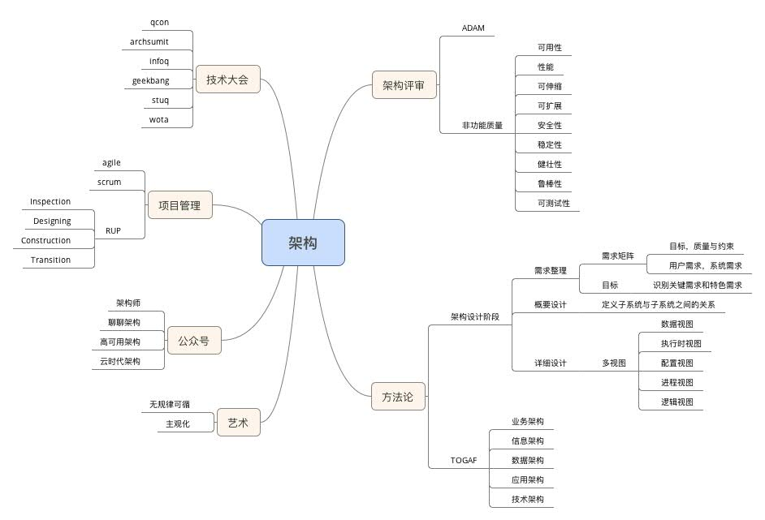
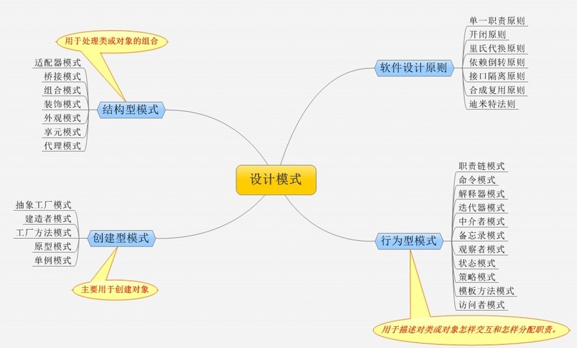

## 知识图谱
>* 1.1 架构师图谱.jpg
>>
>* 1.1架构师图谱.jpg
>>
>* 1.2Java架构师图谱.jpg
>>
>* 1.3微服务架构秘籍.jpg
>>
>* 1.4一致性图谱.jpg
>>
>* 1.5互联网大流量的方法.jpg
>>
>* 1.6安全秘籍.jpg
>>
>* 1.7阿里巴巴常用小框架.jpg
>>
>* 1.8架构方法论图谱.jpg
>>
>* 1.9设计模式秘籍图谱.jpg
>>
>* 2.1JVM虚拟机垃圾回收图谱.png
>>
>* 2.2Java并发图谱.jpg
>>
>* 2.3Java集合图谱.jpg
>>
>* 2.4Java集合类图.jpg
>>
>* 2.5JavaList类图.jpg
>>
>* 2.6JavaMap类图.jpg
>>
>* 2.7JavaSet类图.jpg
>>
>* 2.8JavaTCPIP.png
>>
>* 3.1Hadoop技能图谱.jpg
>>
>* 3.2大数据技能图谱.jpg
>>
>* 4.1云计算图谱.jpg
>>
>* 4.2云计算技能图谱.jpg
>>
>* 5.1iOS技能图谱.jpg
>>
>* 5.2OpenResty技能图谱.jpg
>>
>* 5.3前端技能图谱.jpg
>>
>* 5.4容器技能图谱.jpg
>>
>* 5.5嵌入式开发技能图谱.jpg
>>
>* 5.6开发语言宝典.jpg
>>
>* 5.7移动端测试图谱.jpg
>>
>* 5.8运维技能图谱.jpg
>>
>* 5.9软件工程图谱.jpeg
>>
>* 5.10DevOps图谱.jpg
>>
>* 5.11前端开发图谱.jpg
>>
>* 5.12后端开发图谱.jpg
>>
>* 5.13软件发布流程.jpeg
>>